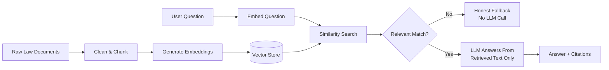

# 🏏 Cricket Laws RAG

Ask questions about the Laws of Cricket in plain English and get answers grounded in the real rule text — with the exact Law and Section cited every time.

> *"When is a batter out LBW?"* → a clear answer, sourced from Law 36, Section 36.1.
> *"What's the capital of France?"* → an honest "I don't know that from these rules," not a guess.

## Overview

Cricket Laws RAG is a **Retrieval-Augmented Generation (RAG)** app: instead of letting a language model answer from memory (and risk a confident but wrong answer), it first searches an indexed copy of the actual Laws of Cricket for the most relevant passages, then asks the LLM to answer using *only* that retrieved text. If nothing relevant is found, it says so instead of guessing.

- 📖 Indexes the full 42 Laws of Cricket (any authorized PDF/HTML/TXT source you provide)
- 🔍 Semantic search over rule text, not keyword matching
- 🧠 Answers generated by an LLM, strictly grounded in retrieved passages
- 🔗 Every answer cited back to its exact Law and Section
- 🚫 Refuses to answer out-of-domain questions instead of hallucinating

## How It Works



**Offline (once per corpus):** raw documents are cleaned, split by Law/Section, and turned into embeddings stored in a vector database.

**Online (every question):** the question is embedded and matched against the index. If nothing clears the relevance bar, the app says so — the LLM is never called. Otherwise, the LLM generates an answer using only the retrieved passages, and the app cites exactly where each answer came from.

## Tech Stack

| Layer | Technology | Purpose |
|---|---|---|
| Language | Python | Core pipeline and app logic |
| UI | Streamlit | Chat-style web interface |
| Embeddings | fastembed (ONNX Runtime) | Turns text into searchable vectors |
| Vector Store | FAISS / PostgreSQL + pgvector | Similarity search, local or persistent |
| LLM | Groq (Llama 3.3 70B) | Generates grounded answers |
| Config & Validation | Pydantic | Typed settings and data models |
| Testing | pytest | Automated test coverage |
| Deployment | Render | Hosting for app + database |

## Getting Started

```bash
python -m venv .venv
```

Windows: `.venv\Scripts\activate` — macOS/Linux: `source .venv/bin/activate`

```bash
pip install -r requirements.txt
cp .env.example .env
```

Fill in `.env` with your LLM API key (see [.env.example](.env.example) for all options — `LLM_PROVIDER`, `LLM_API_KEY`, optional `DATABASE_URL` for persistent storage).

### Add your corpus

Place authorized `.txt`, `.html`, or `.pdf` files in `data/raw/` (a small original sample is included so the demo works out of the box).

### Build the index

```bash
python scripts/ingest.py
```

### Run the app

```bash
streamlit run app.py
```

## Testing

```bash
pytest -q
```

## Deployment

Deployed on [Render](https://render.com) as a Python web service, with an optional Render PostgreSQL database (via `pgvector`) for a persistent index that survives restarts.

## Limitations

- Retrieval quality depends on chunk/threshold tuning — see `evaluation/evaluate.py` for measured numbers on your corpus.
- No hybrid search or reranking yet — pure vector similarity.
- Follow-up questions aren't rewritten with conversation context before retrieval.

## Copyright & Corpus

This project ships no copyrighted rules text. Ingestion is local-file-only — you supply your own authorized corpus in `data/raw/` (gitignored), and only two small, original sample files are committed for the demo. See the source code for full details on how source attribution is handled.
