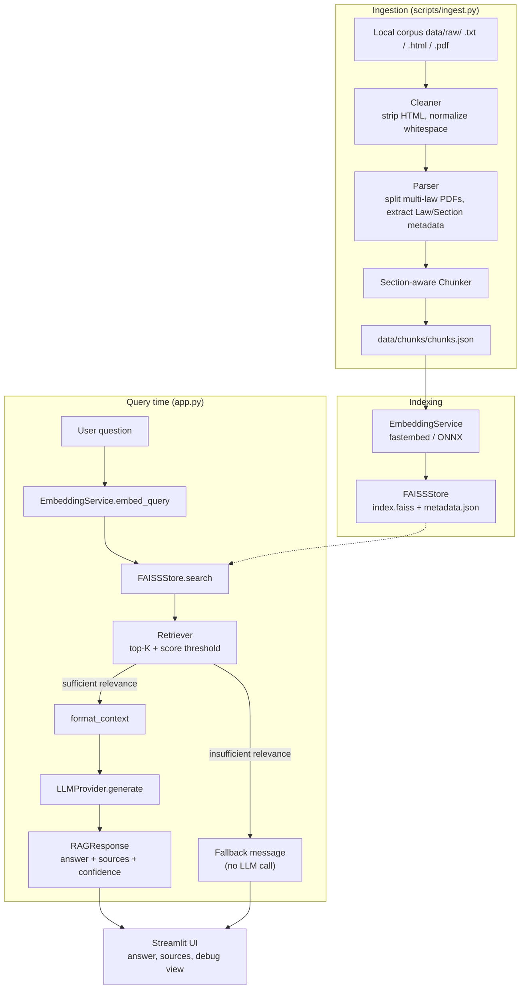

# 🏏 Cricket Laws RAG

A retrieval-augmented generation (RAG) system that answers questions about the Laws of Cricket from an authorized, locally-indexed corpus — with every component (ingestion, chunking, embeddings, vector search, generation) implemented as plain, inspectable Python rather than hidden behind a framework.

Built with Python, Streamlit, fastembed (ONNX Runtime), FAISS, and a pluggable LLM provider (Groq/GroqCloud by default).

## Project Overview

Ask a question like *"When is a batter out LBW?"* and the system:

1. Embeds your question and searches a FAISS index of chunked cricket-law text.
2. Filters retrieved chunks by a similarity threshold — if nothing clears the bar, it says so instead of guessing.
3. Sends only the retrieved chunks (never outside knowledge) to an LLM to write a grounded explanation.
4. Shows you exactly which Law/Section the answer came from, with a link back to the source.

If you ask something outside the corpus (*"What is the capital of France?"*), it explicitly declines rather than hallucinating an answer.

## Architecture



## How RAG Works Here

- **Retrieval** (`src/retrieval/retriever.py`): embeds the question, runs FAISS similarity search, and splits results into `raw_results` (everything found, for debugging) and `filtered_results` (only what clears `SIMILARITY_THRESHOLD`).
- **Relevance gate**: if `filtered_results` is empty, the pipeline returns a fixed fallback message and **never calls the LLM** — this is what keeps out-of-domain questions from getting hallucinated answers.
- **Context construction** (`src/generation/prompts.py`): retrieved chunks are labeled (`[Law 36 | Section 36.1]`) and bounded by `MAX_CONTEXT_CHUNKS`/`MAX_CONTEXT_CHARS` so the prompt stays a fixed, inspectable size.
- **Generation** (`src/generation/llm.py`): a strict system prompt instructs the model to answer only from the provided context, distinguish "what the source says" from "my explanation", and treat retrieved text as data — never as instructions (prompt-injection defense).
- **Citations are structural, not parsed**: `RAGPipeline` builds the "Sources" list directly from the metadata of the chunks that were actually retrieved — never by parsing the LLM's free-text answer. This is why citation accuracy doesn't depend on how well the model follows formatting instructions.

## Data Ingestion

`src/ingestion/` is local-file-only — there is no live-scraping path. `LocalDocumentLoader` (behind a `BaseSourceLoader` interface, in case another local source is added later) reads every `.txt`, `.html`, and `.pdf` file in `data/raw/`:

- **`.txt`/`.html`** files are assumed to hold a single law each (matching a `Law N - Title` header) and become one `Document`.
- **`.pdf`** files are assumed to potentially contain *many* laws in one file — e.g. the official Laws of Cricket is ~180 pages covering 42 laws. `parser.split_into_laws()` finds every genuine `LAW N TITLE` heading (printed in full caps in real Law/rules PDFs) and turns each into its own `Document`, all sharing the source PDF's `file://` URL. Real official PDFs of this kind typically also contain a contents page and sometimes a separate, more detailed index that repeats the same headings — `split_into_laws()` tells these apart from real body content by checking whether the text right after a heading is mostly "title ... page-number" lines (a listing) versus actual prose, discarding the listings. If no law structure is found at all, the whole PDF is indexed as a single `Document`, same as any other unstructured file.
- **`cleaner.py` / `parser.py`** — strip HTML, normalize whitespace, hash content for duplicate detection, extract `Law N — Title` / `N.N` section structure via regex, and extract an edition string like `2017 Code 4th Edition - 2026` when present. Section splitting deliberately stops at two numbering levels (`N.N`); deeper enumeration such as `36.1.1` stays as body text within its parent section rather than fragmenting into one chunk per sub-point.

## Chunking Strategy

`src/chunking/chunker.py` implements **section-aware** chunking: one chunk per `Law → Section`, not blind fixed-size splitting. A section that exceeds `CHUNK_SIZE` (word count, used as an explicit, documented proxy for tokens) is split into overlapping pieces using `CHUNK_OVERLAP`, and every resulting chunk still carries full Law/Section/source metadata. Exact-duplicate chunks (by content hash) are dropped at the corpus level.

`CHUNK_SIZE` (default 650) and `CHUNK_OVERLAP` (default 80) are starting points, not universally correct values — tune them against `evaluation/questions.json`.

## Embedding Model

`src/embeddings/embedding_service.py` wraps [fastembed](https://github.com/qdrant/fastembed) (`EMBEDDING_MODEL`, default `sentence-transformers/all-MiniLM-L6-v2` — same model, run via ONNX Runtime rather than PyTorch). Vectors are already L2-normalized by fastembed, which is what lets the FAISS index use inner product as cosine similarity. Swapping models is a config change, not a code change.

fastembed was chosen over the more common `sentence-transformers` specifically because it doesn't depend on `torch` — torch alone was enough to exceed a 512MB deployment host's memory at process startup (see [Deployment](#deployment) below). It also turned out faster to load in practice.

## FAISS Retrieval

`src/vectorstore/faiss_store.py` wraps a `faiss.IndexFlatIP` index. Every vector is paired 1:1 with the `Chunk` it came from via `vector_store/metadata.json` — the index never holds bare numbers without metadata. Supports `add`/`search`/`save`/`load`, corpus-level duplicate protection (by content hash, persisted across reloads), and returns similarity scores alongside every result.

## LLM Generation

`src/generation/llm.py` defines an `LLMProvider` interface (`generate(question, context, conversation_history=None)`) so the rest of the app never imports a provider SDK directly. The included implementation, `GroqLLM`, uses the `openai` SDK pointed at Groq's OpenAI-compatible endpoint (`https://api.groq.com/openai/v1`) — Groq hosts fast inference for open models (Llama, Mixtral, etc.) rather than shipping its own model family. Swapping providers means adding one class and registering it in `get_llm_provider()`.

## Source Attribution

Every chunk keeps its `source_url` (a `file://` path to the source `.txt`/`.html`/`.pdf` it came from) and, where extractable, an `edition` string, from ingestion through to the final answer. The app never exposes a bulk-downloadable copy of the corpus.

## Installation

```bash
python -m venv .venv
```

Windows:
```bash
.venv\Scripts\activate
```
macOS/Linux:
```bash
source .venv/bin/activate
```

```bash
pip install -r requirements.txt
```

Windows:
```bash
copy .env.example .env
```
macOS/Linux:
```bash
cp .env.example .env
```

## Environment Variables

See [.env.example](.env.example) for the full list. Key ones:

| Variable | Purpose |
|---|---|
| `EMBEDDING_MODEL` | fastembed model name |
| `LLM_PROVIDER` / `LLM_MODEL` / `LLM_API_KEY` | LLM provider config (`groq` is the built-in provider) |
| `GROQ_API_KEY` | Alias for `LLM_API_KEY` (mapped automatically; `GROK_API_KEY` also still accepted for backwards compatibility) |
| `TOP_K` / `SIMILARITY_THRESHOLD` | Retrieval size and relevance cutoff |
| `CHUNK_SIZE` / `CHUNK_OVERLAP` | Chunking parameters |

Never commit `.env` — it's already in `.gitignore`.

## Local Corpus

Two small, **original, self-written** sample files (`law_36_sample.txt`, `law_21_sample.html`) covering LBW and No Ball live in `tests/fixtures/` and are used by the automated tests. **This is placeholder content, not the official MCC Laws of Cricket text** — see [Copyright](#copyright--source-considerations) below.

`data/raw/` is where ingestion actually reads from (`.txt`, `.html`, and `.pdf` are all supported — see [Data Ingestion](#data-ingestion) for how multi-law PDFs get split), and its contents are gitignored on purpose (it's environment-specific, user-supplied data — see [.gitignore](.gitignore)). On a fresh clone it's empty. To reproduce the demo numbers in this README with the small sample fixtures:

```bash
cp tests/fixtures/law_36_sample.txt tests/fixtures/law_21_sample.html data/raw/
python scripts/ingest.py
```

For real use, place your own authorized corpus (text, HTML, or PDF files you have the rights to index) in `data/raw/` instead.

## Running Ingestion

```bash
python scripts/ingest.py
```

This loads the corpus, cleans/parses/chunks it, saves chunks to `data/chunks/chunks.json`, generates embeddings, and builds `vector_store/`. Example output:

```
Documents loaded: 2
Laws found: 2
Sections found: 5
Chunks created: 5
Embeddings generated: 5
Vector index built successfully.
```

Other scripts:

```bash
python scripts/build_index.py
```
Re-embeds already-parsed chunks (e.g. after changing `EMBEDDING_MODEL`) without re-reading the source corpus.

```bash
python scripts/inspect_chunks.py --count 20
```
Prints a random sample of chunks for debugging chunk quality. Supports `--law`, `--seed`, `--text-limit`.

## Running Streamlit

```bash
streamlit run app.py
```

The sidebar shows live knowledge-base stats (chunk/law counts, last-indexed time) and has **Rebuild index** / **Reindex from saved chunks** / **Reload index from disk** controls — the app never re-parses or re-embeds on its own. Enable **Show retrieval details** to see raw retrieval scores per chunk alongside every answer.

## Deployment

Deployed on [Render](https://render.com) as a Python web service pointed at this repo:

| Field | Value |
|---|---|
| Root Directory | *(blank — `app.py` is at the repo root)* |
| Build Command | `pip install -r requirements.txt` |
| Start Command | `streamlit run app.py --server.port $PORT --server.address 0.0.0.0 --server.headless true` |
| Environment Variables | `LLM_PROVIDER=groq`, `LLM_API_KEY=<your key>`, `LLM_MODEL=llama-3.3-70b-versatile` |

The Start Command's flags aren't optional: Render assigns a random port via `$PORT` and requires the service to bind `0.0.0.0`, not `localhost`, or the health check fails and the deploy never goes live.

**Memory matters more than it looks like it should.** The first deploy attempt used `sentence-transformers`, which pulls in `torch` — importing it alone was enough to exceed Render's free tier (512MB RAM), crashing the process before it ever served a request. Two fixes, both now in the code:
1. The embedding-model import is deferred into `EmbeddingService.__init__` rather than sitting at module level, so it's only paid for once an embedding is actually requested, not at process boot.
2. `torch`/`sentence-transformers` were replaced with `fastembed` (ONNX Runtime), which has no torch dependency at all and a much smaller runtime footprint for the same model.

No FAISS index is committed to the repo (to avoid ever risking copyrighted chunk text landing in git history), so after each fresh deploy, click **Rebuild index** once in the sidebar to build it from `data/raw/`'s committed demo corpus.

## Evaluation

```bash
python evaluation/evaluate.py
```

Runs `evaluation/questions.json` (32 questions across direct/condition/scenario/comparison/follow-up/out-of-domain categories, with expected Law/Section grounded in what's actually indexed) against whatever is currently in `vector_store/`. Reports **measured** Retrieval Recall@K, Citation Accuracy, Supported Answer Rate (skipped honestly if no LLM is configured, since faking it would violate the whole point of the harness), and Out-of-domain rejection — no hard-coded scores.

Without an LLM configured, `Supported Answer Rate` prints `SKIPPED` instead — it is never fabricated. **These numbers are not stable as the corpus grows or the embedding backend changes**, which is exactly the kind of thing the harness exists to catch — three real, measured runs told three different stories:

| Run | Corpus | Embedding backend | Recall@5 | Citation Acc. | Supported Answer | OOD rejection |
|---|---|---|---|---|---|---|
| 1 | 2-law demo (5 chunks) | sentence-transformers | 100.0% | 91.7% | 100.0% | 62.5% |
| 2 | Real 42-law (881 chunks) | sentence-transformers | 37.5% | 100.0% | 50.0% | 62.5% |
| 3 | Real 42-law (886 chunks) | fastembed (current) | **83.3%** | **100.0%** | **79.2%** | 62.5% |

Run 2 was a real, measured regression, not a bug: at 881 candidate chunks, `sentence-transformers/all-MiniLM-L6-v2` sometimes ranked a different dismissal law above the one actually asked about — for *"When is a batter out LBW?"*, the Law 36.1 (LBW) chunk scored only 0.47 cosine similarity against the query, while Law 38 (Run Out) and Law 40 (Timed Out) scored 0.57–0.59 and got returned instead.

Run 3 uses `fastembed` (ONNX Runtime) instead — adopted primarily to fix a deployment memory problem (see [Deployment](#deployment)), not for retrieval quality. It happened to fix both: the same LBW query now scores Law 36.1 at 0.676 and ranks it first. This wasn't the goal, it's a side effect worth being honest about rather than claiming credit for — a different ONNX export of nominally "the same" model measurably changed retrieval behavior, which is itself a useful reminder that these numbers must be re-measured after any backend change, not assumed to transfer.

## Testing

```bash
pytest -q
```

97 tests across ingestion (cleaner, parser, multi-law PDF splitting, loader), chunking, embeddings, the FAISS store, retrieval, LLM generation (mocked SDK, no real API calls), and the RAG pipeline.

## Limitations

- **Retrieval recall drops at full-corpus scale even with the current backend.** 83.3% Recall@5 (fastembed, 886 chunks) is a large improvement over the earlier 37.5% (sentence-transformers), but still well short of the 100% seen on the tiny demo corpus — see the three-run comparison under Evaluation. Reranking or hybrid search would likely close more of that gap.
- **Uncalibrated thresholds.** `SIMILARITY_THRESHOLD`, `CHUNK_SIZE`/`CHUNK_OVERLAP`, and the confidence-band cutoffs are starting points; use `evaluation/evaluate.py` to tune them against a real corpus.
- **Near-duplicate content across related PDFs isn't merged.** The ICC Playing Conditions PDFs each re-print the 42 base Laws with small wording differences (e.g. "See Appendix A.13" vs. "See paragraph 13 of Appendix A"), so exact-hash deduplication doesn't catch them — multiple near-identical chunks can end up competing in retrieval. Semantic/near-duplicate detection is a V2 concern (see Future Improvements).
- **`split_into_laws()` heading detection is regex/heuristic-based**, tuned against the real MCC Laws of Cricket PDF structure (all-caps headings, contents page, detailed index). It correctly found all 42 laws there, plus one harmless extra front-matter chunk mislabeled as a law; a differently-formatted PDF may need the regex adjusted, or may fall back to being indexed as a single undivided document.
- **No query rewriting.** Follow-up questions are answered with conversation history passed to the LLM, but retrieval always runs on the current question's raw text — a context-free follow-up like "what happens after that?" will not retrieve well (see `q25` in the evaluation set, which documents this deliberately).
- **Faithfulness metric is a heuristic.** "Supported Answer Rate" is lexical word-overlap between answer and context, not a semantic entailment check.
- **Confidence bands reflect retrieval relevance only**, not factual certainty about the generated answer.
- No hybrid/BM25 search, reranking, or multi-query retrieval — see Future Improvements.

## Copyright / Source Considerations

The conceptual source for this project is the official MCC Laws of Cricket, but the code makes **no assumption that the user is entitled to redistribute whatever they put in `data/raw/`**:

- Ingestion is **local-file-only** — there is no live scraper, no crawler, and no bundled copy of any rules text in this repository. `data/raw/` is entirely gitignored (see [.gitignore](.gitignore)); whatever corpus you index there is yours to supply and is never committed.
- The only text that *is* committed is `tests/fixtures/` — two small, original, self-written samples used purely to test the pipeline, not copied from the official Laws.
- Placing a copyrighted PDF (e.g. an official Laws of Cricket or ICC Playing Conditions document) in `data/raw/` for **local, personal indexing and question-answering** is the intended use case — the same way you'd keep a PDF open in a reader. It is the user's responsibility to ensure they're entitled to use whatever they place there.
- The app never exposes a bulk-downloadable copy of the indexed corpus; it only ever returns short, cited excerpts in response to specific questions, alongside a `file://` reference back to the source document.
- If you later add a live-fetching source adapter, apply the same discipline the original scraper implementation in this project's history did: check `robots.txt` and terms of use first, rate-limit, never bypass auth/CAPTCHAs, and keep it opt-in rather than default.

## Future Improvements

Deliberately out of scope for this MVP (see spec section 45): hybrid BM25 + vector search, cross-encoder reranking, query expansion / multi-query retrieval, parent-child retrieval, automatic source monitoring and incremental indexing, edition/version comparison (e.g. 2017 vs. 2026 Code), OCR, multilingual support, voice input, user accounts, an analytics dashboard, a cloud vector database, and agentic workflows.
